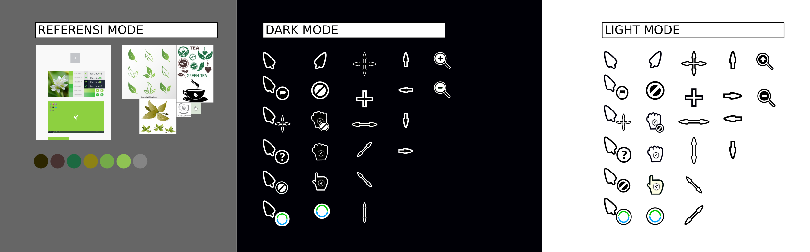

## Tea Cursors Pack

    

   > ```Tea Cursors Pack``` adalah paket cursor yang baru dikembangkan oleh para ```DEVELOPER DOSCOM``` yang bersamaan dengan update SISTEM OPERASI distro `TEALINUXOS XI`

   > ```Tea Cursors Pack``` ini sendiri tersedi adalam 2 mode yaitu mode dark and ligt mode `dark` cocok buat kamu yang secara basic lebih senang menggunakan warna terang sedangkan mode `light` cocok buat kamu yang suka dengan ketenangan karena lebih bersahabat

   > ```Tea Cursors Pack``` ini nantinya akan di ```release``` bersamaan dengan update ```TEALINUXOS``` yang terbaru saat ini ```Tea Cursor Pack``` masih dalam mode ```BETA``` dan nantinya akan dikembangkan lebih baik lagi